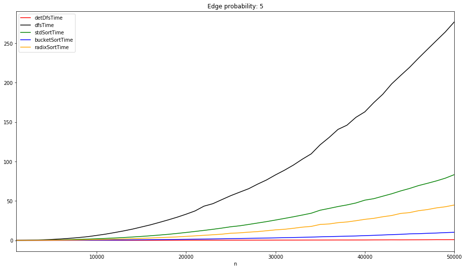

## Изменения с последней сдачи

Нами была проделана следующая работа:
1. Рекурсивный поиск в глубину был изменен на поиск с использованием цикла _while_ и стека во избежании переполнения стека вызова функций - [link](https://github.com/qmandkili/Bridges/commit/0dc981298b66799b9b71b10696ed1253e94fa993#diff-d628f85feb0d0eb8a913c480ff8f1a6a)
2. Был исправлен _radix-sort_ - [link](https://github.com/qmandkili/Bridges/commit/0dc981298b66799b9b71b10696ed1253e94fa993#diff-313f563ffd303c99f242f4f7cec92ae5)
3. Были проведены эксперименты на больших графах (стресс тест) от 1 000 до 50 000 вершин с шагом 1000. Полученные временные результаты были визуализированы.

Можно увидеть, что сложность действительно линейная.

Все результаты, а также визуализация 1 и 2 мостов на графах описана в README.md и в jupyter ноутбуке - notebook.ipynb

Работу выполнили:
1. Антон Исаев
2. Александр Ляшук
